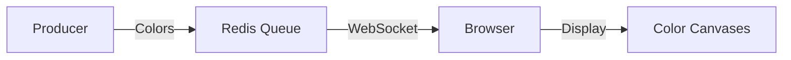

# 🎨 Color Sprayer

<div align="center">


[](https://nestjs.com/)
[](https://redis.io/)
[](https://socket.io/)
[](https://www.docker.com/)

*A mesmerizing real-time color visualization system that transforms random HTML colors into beautiful streaming art.*

</div>

---

## 🌟 Overview

Color Sprayer is a dynamic web application that generates, categorizes, and visualizes HTML colors in real-time. Watch as random colors are sprayed across your screen, automatically sorted into their closest primary color groups, creating an ever-growing canvas of digital art.

### 🎯 Key Features

- 🌈 Real-time color generation and streaming
- 🎨 Intelligent color categorization
- 📊 Live statistics and counters
- 🔄 WebSocket-powered updates
- 📈 Auto-expanding color canvases
- 💾 Persistent statistics
- 🚀 Redis-backed message queue

## 🏃‍♂️ Quick Start

### Prerequisites

- Docker
- Docker Compose

### One-Command Setup

```bash
docker-compose up --build
```

That's it! Visit `http://localhost:3000` to see the magic happen. ✨

## 🛠 Run App

```bash
docker-compose up --build
```

Go to [http://localhost:3000](http://localhost:3000) to see the magic happen. ✨


## 🎮 Controls

- 🔄 Refresh page: Reset visualization
- 📊 Stats auto-update every second
- 🖼 Canvases grow automatically
- 🎨 Colors are categorized in real-time

## 🎨 Color Categories

Your colors will be sorted into these primary groups:
```
🔴 Red    🟠 Orange   💛 Yellow
💚 Green  🔵 Blue     💜 Purple
💗 Pink   🤎 Brown    ⚪️ White
⚫️ Black  🔘 Gray
```

## 🔧 Docker Commands

```bash
# Start services
docker-compose up -d

# View logs
docker-compose logs -f

# Stop services
docker-compose down

# Rebuild
docker-compose up --build

# Reset everything
docker-compose down -v
```

## 🏗 Architecture



- **Producer**: Generates random HTML colors
- **Redis Queue**: Message broker
- **WebSocket**: Real-time communication
- **Browser**: Visualization and categorization

## 💡 How It Works

1. 🎨 Producer generates random HTML colors
2. 📥 Colors enter Redis queue
3. 🔄 WebSocket broadcasts to clients
4. 🎯 Colors are categorized by RGB distance
5. 🖼 Each category displays in its canvas
6. 📈 Stats update in real-time

## 🐳 Container Structure

```
color-sprayer
├── app (NestJS)
│   └── 🚀 Port 3000
└── redis
    └── 💾 Port 6379
```

## 🔍 Troubleshooting

```bash
# Redis connection issues
docker-compose restart redis

# Application issues
docker-compose restart app

# Check status
docker-compose ps

# View app logs
docker-compose logs -f app
```

## 🚀 Performance Tips

- Each canvas efficiently manages its own memory
- Automatic cleanup of old data
- Optimized WebSocket connections
- Efficient color categorization algorithm

## 🤝 Contributing

Contributions welcome! Feel free to:
- 🐛 Report bugs
- 💡 Suggest features
- 🔧 Submit PRs

## 📝 License

MIT License - feel free to use and modify!

---

<div align="center">
Made with ❤️ and lots of 🎨
</div>
